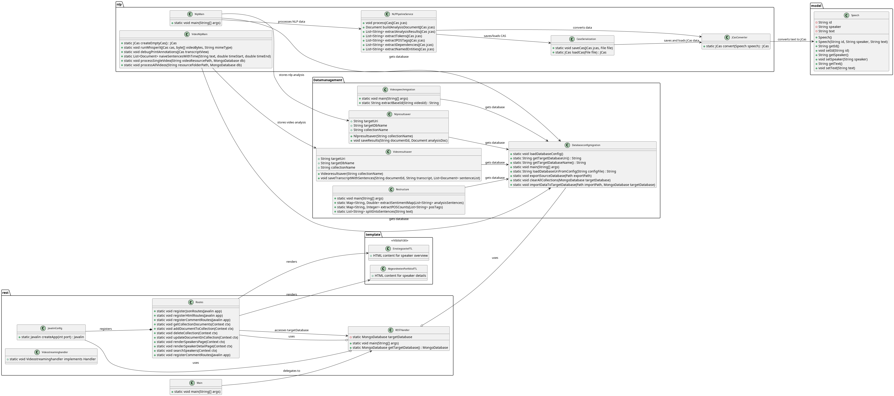
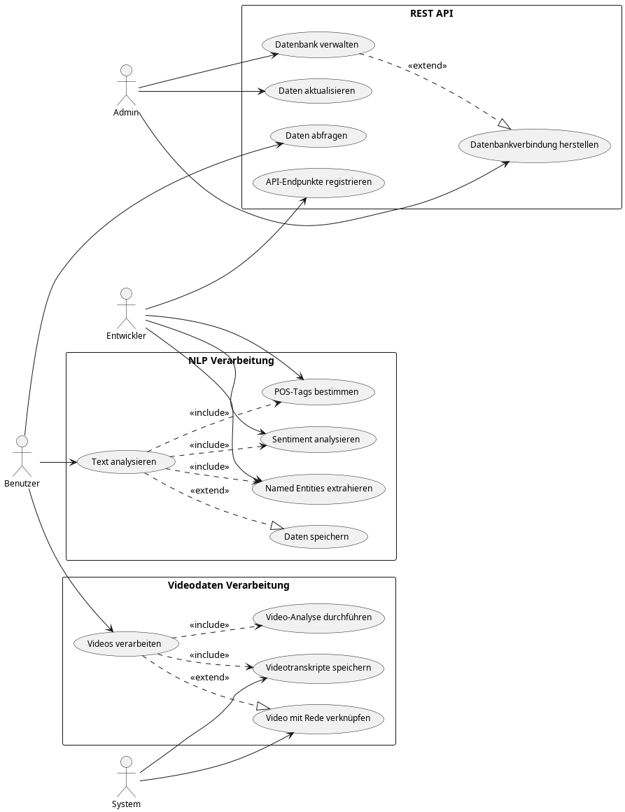

# **ÜBUNG 4 – NLP-Analyse & Datenbankintegration**






---

## **Einleitung**
Dieses Projekt erweitert die **Verwaltung und Analyse von Bundestagsabgeordneten-Daten** um eine **automatische NLP-Analyse** für Reden und Videodaten. Es integriert die NLP-Ergebnisse direkt in die **speech-Collection der MongoDB-Datenbank** und bietet eine Weboberfläche zur Visualisierung.

**Neue Kernfunktionen:**
- **Textanalyse von Reden mit NLP-Techniken**
- **Transkription und Analyse von Videoaufnahmen**
- **Speicherung der NLP-Ergebnisse direkt in der `speech`-Collection**
- **Erweiterte REST-API zur Verwaltung der NLP-Ergebnisse**

---

## **Neue Funktionen in Übung 4**
- **Automatische NLP-Analyse für Bundestagsreden (Text & Video)**
    - **POS-Tagging** (Part-of-Speech-Erkennung)
    - **Named Entity Recognition (NER)**
    - **Sentiment-Analyse**
    - **Strukturierte Redetransformation**
- **Video-Analyse mit WhisperX**
    - **Automatische Transkription**
    - **Zeitsynchronisierte Sätze**
- **MongoDB-Integration**
    - **NLP-Analyse wird direkt in der `speech`-Collection gespeichert**
    - **Neue Felder für POS-Tags, Named Entities und Sentiment-Werte**
- **Erweiterung der REST-API**
    - Neue Endpunkte für NLP-Analyse und Videoverarbeitung

---

## **Architektur**
Das Projekt folgt einer **modularen Architektur** mit separaten Komponenten für **REST-API, NLP-Analyse und Datenbankverwaltung**.

**Neue Architekturkomponenten in Übung 4:**
1. **NLP-Analyse (`nlp`-Package)**:
    - `NLPPipelineService`: NLP-Analyse für Texte
    - `VideoNlpMain`: NLP-Analyse für Videos
    - `JCasConverter`: Konvertiert Redetexte für NLP
    - `CaseSerialization`: Speichert und lädt NLP-Daten
2. **REST-API (`rest`-Package)**:
    - Neue Endpunkte für NLP- und Video-Analyse
3. **Datenbank (`Datamanagement`-Package)**:
    - `Nlpresultsaver`: Speichert NLP-Ergebnisse direkt in `speech`
    - `Videoresultsaver`: Speichert Video-Analysen in MongoDB
4. **Web-Frontend (`template`-Package)**:
    - Integration von NLP-Analysen in `abgeordneten_portfolio.ftl`

---

## **Technische Details**

### **NLP-Analyse**
Die **NLP-Analyse** wird mit **JCas und Apache UIMA** durchgeführt.

- **NLPPipelineService**
    - **`processJCas(JCas jcas)`** → Führt NLP-Analyse aus.
    - **`extractPOSTags(JCas jcas)`** → Erkennt Wortarten.
    - **`extractNamedEntities(JCas jcas)`** → Extrahiert Personen, Orte, Organisationen.
    - **`extractAnalysisResults(JCas jcas)`** → Führt Sentiment-Analyse durch.

- **VideoNlpMain**
    - **`runWhisperX(JCas cas, byte[] videoBytes, String mimeType)`** → Erstellt Transkriptionen aus Videos.
    - **`naiveSentencesWithTime(String text, double start, double end)`** → Teilt Reden in Sätze mit Zeitstempeln.
    - **`processSingleVideo(String videoPath, MongoDatabase db)`** → Speichert analysierte Video-Transkripte.

---

### **Datenbank-Integration**
Die Ergebnisse der NLP-Analyse werden **direkt in der `speech`-Collection** gespeichert. Dies ermöglicht eine direkte Verknüpfung von **NLP-Analysen mit den Reden**, ohne eine separate Collection zu benötigen.

#### **1. Speicherung der NLP-Analyse in der `speech`-Collection**
- **Collection:** `speech`
- **Klasse:** `Nlpresultsaver`
- **Beschreibung:**
    - NLP-Analyseergebnisse werden als **zusätzliche Felder innerhalb der `speech`-Dokumente** gespeichert.
    - Dazu gehören:
        - **`posTags`** → Liste aller erkannten Wortarten (POS-Tags)
        - **`namedEntities`** → Liste der erkannten Namen, Orte und Organisationen
        - **`sentimentValues`** → Sentiment-Werte für einzelne Sätze
    - Dies erleichtert die **direkte Abfrage und Visualisierung** der NLP-Ergebnisse.

#### **2. Speicherung der Videoanalyse-Ergebnisse**
- **Collection:** `video_analysis`
- **Klasse:** `Videoresultsaver`
- **Beschreibung:**
    - Enthält die **Transkriptionen und Analysen von Video-Reden**.
    - Enthaltene Informationen:
        - **Automatische Transkription** der Rede
        - **Zeitsynchronisierte Sätze** (Beginn & Ende in Sekunden)
        - **Verknüpfung mit der passenden Rede (`speechId`)**

#### **3. Umstrukturierung der `speech`-Collection**
- **Klasse:** `Restructure`
- **Beschreibung:**
    - Diese Klasse **aktualisiert bestehende `speech`-Dokumente**, um NLP-Ergebnisse zu integrieren.
    - Neue NLP-Daten werden **automatisch als Felder zugeordnet**:
        - **POS-Tags** → Analysierte Wortarten werden hinzugefügt.
        - **Sentiment-Analyse** → Bewertungen der Satzstimmung werden gespeichert.

#### **4. Migration und Verknüpfung von Video- und Speech-Daten**
- **Klasse:** `Videospeechmigration`
- **Beschreibung:**
    - Diese Klasse führt die **Migration von Video-Daten in die `speech`-Collection** durch.
    - **Vorgehensweise:**
        - Reden aus der `video`-Collection werden mit den entsprechenden **speech-Dokumenten** verknüpft.
        - Die Verbindung basiert auf einer **gemeinsamen Basis-ID** zwischen Video- und Speech-Dokumenten.
        - Dadurch werden **gesprochene und transkribierte Inhalte miteinander kombiniert** und können gemeinsam analysiert werden.

---


## Installation

### 1. Projekt klonen:
```bash
git clone https://ppr.gitlab.texttechnologylab.org/Oljaca/uebung4.git
cd uebung4
```

### 2. Abhaengigkeiten installieren:
```bash
mvn clean install
```

### 3. MongoDB konfigurieren:
- Passen Sie die Datei `dbconfig.properties` an, um die Verbindung zur MongoDB zu konfigurieren.

### 4. Docker installieren:

-Linux:
```bash
sudo apt update
sudo apt install docker.io
sudo systemctl enable --now docker
```

### 5. Anwendung starten:
```bash
mvn exec:java -Dexec.mainClass="org/texttechnologylab/project/Nikola_Oljaca/Main"
```

---

## Endpunkte testen

### Beispielaufrufe:
1. **Alle Abgeordneten anzeigen:**
    - **GET:** `http://localhost:7080/einstiegsseite`

2. **Portfolio eines Abgeordneten:**
    - **GET:** `http://localhost:7080/abgeordneten_portfolio/{id}`

---

## Lizenz

Dieses Projekt steht unter der MIT-Lizenz. Weitere Informationen finden Sie in der `LICENSE`-Datei.


